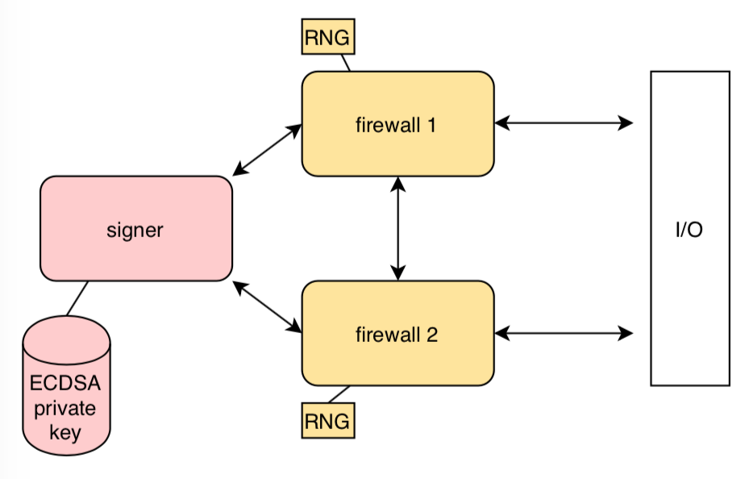

# Firewalled ECDSA signatures

Firewalled ECDSA signatures are like ECDSA but without the bad things ECDSA has.
The main advantage of firewalled ECDSA signatures is that
a malicious signer _alone_ can't leak any secrets.
In the 99.999% of the cases you shouldn't care about this
(use a safe ECDSA variant like RFC 6979 or EdDSA and carry on)
but tonight we aren't here to do threat modeling --we're here to nerd out!

Firewalled ECDSA signatures prevent an ECDSA signer
from surreptitiously exfiltrating the private key.
This property might be useful in the following scenarios:

1. you run ECDSA on an HSM, but you don't fully trust the HSM manufacturer
2. you run ECDSA on an HSM, but you're not 100% sure the HSM manufacturer is competent enough to implement ECDSA properly
3. you run ECDSA on an HSM, but you're not 100% sure the HSM manufacturer isn't using a sketchy PRNG, a backdoored one, or a (formerly) standardized and backdoored PRNG!
4. you run ECDSA on an HSM, but you're not 100% sure the HSM manufacturer infrastructure didn't get pwned and a third party (or fourth? fifth?) planted a backdoor in the HSM code

You might be thinking these are unrealistic scenarios.
We don't discuss this here. There are however documented
cases for 2, 3 and 4, [briefly discussed below](#ecdsa-graveyard).

How do firewalled ECDSA signatures work? Well, the main difference wrt vanilla ECDSA lies in
how trust is placed during the signing process. 
Instead of placing full trust on a single signer,
firewalled signatures distribute trust across a signer _and_
several _cryptographic reverse firewalls_.
These firewalls engage with the signer during the signing process.
Their purpose is to ensure the signer behaves and doesn't do anything naughty,
such as trying to exfil the private key.
As long as at least one firewall stays honest,
the resulting signature can't leak any secret.
A key point here for this semi-fantasy to make sense is that
firewalls do not store nor compute on long-term secrets;
thus, they are cheap, easy to build and easier to trust.

**Warning**. This is of course a Sunday hack. Don't use it for anything.

## Demo

We love blinking lights, so here's a small demo.
On the following video we have a signer on the bottom part
(the black screen covering a raspberry pi)
and and two firewalls on top (the two phones).
All three devices talk to each other over a LAN and if everything checks,
the firewalled ECDSA signature ends up displayed as QR codes on each firewall.


(Running time is terrible, but that's because this clown
implementation is written in python.
The overhead of adding firewalls is very manageable.)

## Architecture

To generate a firewalled ECDSA signature,
a single signer talks to several firewalls arranged like this:



* The __signer__ is responsible for storing long-term secrets and doing the bulk of the computation involving secrets. Thus, it's expected to be some kind of programmable HSM. Note this HSM doesn't exactly implement a regular ECDSA signature operation -- say, a PKCS#11 interface may not be enough.  
* The __firewalls__ will make sure the signer behaves. Firewalls do not handle secrets. Using more than one firewall is possible -- ideally there's diversification among them.

## Protocol

Firewalling a signature scheme where the coins are public
(such as RSA-PSS) is easy. In ECDSA the signer uses randomness
that must be kept secret forever and this makes firewalling
a bit less straightforward. The following protocol comes from [several
papers](#references) of the great [Henry Corrigan-Gibbs](https://people.csail.mit.edu/henrycg/)
and company. All the bad ideas are exclusively mine.

At a high level this is what happens:
the firewalls inject _their_ randomness into the ECDSA secret nonce.
The trickery is in _how_ this randomness is injected,
in a way no party can cheat or get an advantage;
and making sure this randomness is actually used.

The essence of the protocol is
in the construction of the secret ECDSA nonce.
Say two parties, an HSM and a firewall,
want to jointly generate the "key pair" (ECDSA nonce) `(x, g^x)`
with the following properties:
1. only the HSM ends up knowing the private key `x`
1. the HSM can't bias the private key `x`
1. each party (HSM or firewall) is confident the private key `x` is "high entropy",
provided that its own RNG works (independent of the other party's good faith or RNG)

The protocol goes like this:

```
   HSM                Firewall
   ----------------------------
                      draw v at random
                      prepare commitment for v
                   <- send commitment H(v,r)
    
     draw v' at random
        set V' := g^v'
send pubkey "share" V' ->

                      set X := V' * g^v
                      publish X
                   <- send opening (v, r)

      check v is sound
         set x := v+v'
               store x
```

(In the second part of the protocol, the firewall checks that the nonce is actually used.)

You can find this simple and elegant protocol in the [beautiful True2F paper](#references) by
Dauterman, Corrigan-Gibbs, Boneh and other crypto titans. It generalizes easily to multiple firewalls.
They describe the protocol within the framework of
[cryptographic reverse firewalls](#references) put by Mironov. A rudimentary variant appears in
[an older 1994 paper](#references).

## Implementation

This is a comedy implementation. The purpose is just some quick and dirty experimentation.
There's zero code review and there are known sharp edges.
This code should work with any prime-order curves, such as NIST P-256 or the bitcoin curve. 
All the ECDSA heavy lifting
(`ec.py` and `ecdsa.py`) is taken from [Joseph Birr-Pixton](https://github.com/ctz/u2f-secret-storage).

## ECDSA graveyard

For #2 [above](#firewalled-ecdsa-signatures) ("the HSM manufacturer may screw up the ECDSA implementation"), 
ECDSA is a very sharp knife:
the signer has effectively a life-long liability in ensuring perfect randomness at signing time. If this doesn't hold, security breaks hard.

Let's pick two recent bad bugs ECDSA from last year:
[one by Google in the ECDSA implementation of their in-house H1 security chip](https://www.chromium.org/chromium-os/u2f-ecdsa-vulnerability) and [another by Yubico](https://www.yubico.com/support/security-advisories/ysa-2019-02/#technical-details):
* The Google bug is bad: ECDSA private keys can (probably) be recovered just by inspecting signatures. The bug affected (at least) the U2F implementation in some chromebooks. The bug isn't a product of clowns; you can browse the Chromium OS embedded controller code to realize that it's a product of professional embedded developers with stellar security advice and design. From the changeset, looks like [it's very hard to catch the bug by code review](https://chromium-review.googlesource.com/c/chromiumos/platform/ec/+/1592990). Code _looks_ good, and you've to have a very intimate understanding of the architecture to spot it. We can speculate that misaligned memory accesses caused biased nonces. To detect this, you probably need to dump secret nonces by hand, generated on actual hardware, and stare at them. Probably statistical analysis or lattice headaches isn't needed after all. Still, it takes a great deal of skepticism to not only review the code but also have a look at actual secret nonces. (I'm very curious how this was caught -- the [bug page](https://issuetracker.google.com/issues/131807777) isn't publicly accessible.)  Worth mentioning that they could recover easily by shipping a firmware update -- that's a huge lever in their security model and shows a very solid security design.
* What we can learn about the Yubico bug is that it looks like a failure of an adjacent subsystem (some self-tests seem to overwrite with known values an entropy pool), but not the ECDSA proper. In isolation, probably the ECDSA subsystem is good; it's only when it gets combined with the self-test functionality that ECDSA breaks. Irony has it this issue only shows up in FIPS-certified yubikeys.

For #3 [above](#firewalled-ecdsa-signatures) ("sketchy and standardized PRNG") see [Dual EC DRBG](http://projectbullrun.org/dual-ec/) used in RSA BSAFE and others.

For #4 [above](#firewalled-ecdsa-signatures) ("the HSM manufacturer may get pwned and a third party can plant a backdoor")
see the [2015 Juniper backdoor saga](https://blog.cryptographyengineering.com/2015/12/22/on-juniper-backdoor/). A third party (the NSA) plants a backdoor in a standardized PRNG, and in a juicy plot twist a _fourth_ party breaks in Juniper Networks and replaces the NSA backdoor with _their own backdoor_ by changing a constant in the source code.

## References

E. Dauterman, H. Corrigan-Gibbs, D. Mazières, D. Boneh and D. Rizzo.
[True2F: Backdoor-resistant authentication tokens](https://www.scs.stanford.edu/~dm/home/papers/dauterman:true2f.pdf). SP 2019

H. Corrigan-Gibbs, W. Mu, D. Boneh, and B. Ford.
[Ensuring high-quality randomness in cryptographic key generation](https://people.csail.mit.edu/henrycg/pubs/ccs13ensuring/). CCS 2013

I. Mironov, N. Stephens-Davidowitz.
[Cryptographic Reverse Firewalls](https://eprint.iacr.org/2014/758). EUROCRYPT 2014

P. Horster, M. Michels, H. Petersen.
[Subliminal Channels in discrete logarithm based signature schemes and how to avoid them](https://www.semanticscholar.org/paper/Subliminal-Channels-in-discrete-logarithm-based-and-Horster-Michels/51f4b0fd3907ed0cf8c1ad03f12f90eb95a9f604)


## Contact

Oscar Reparaz <firstname.lastname@esat.kuleuven.be>